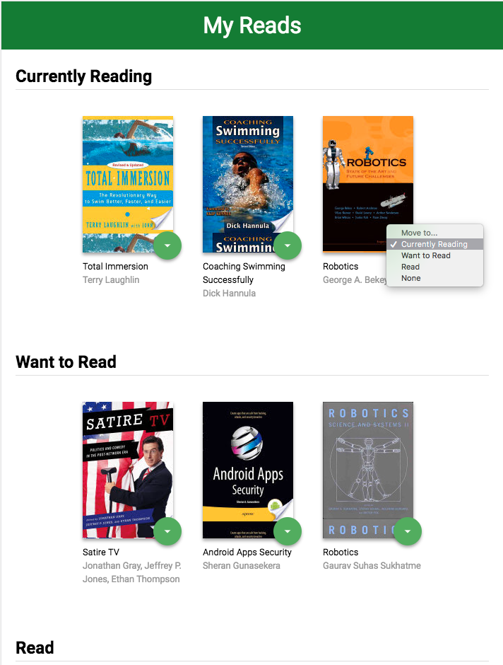
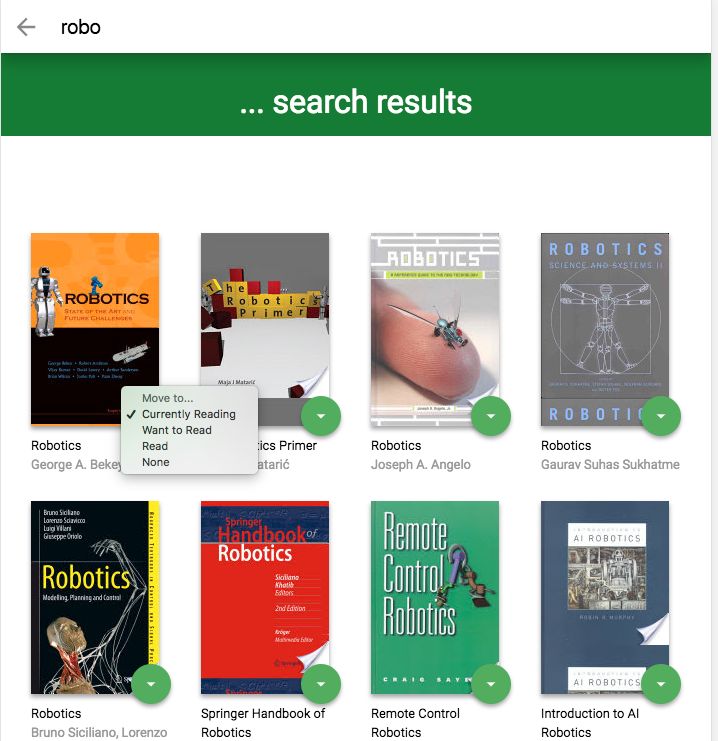

# My Reads
---

## Project:

First project for REACT Udacity nanodegree. Shows the basic structure and operation of React-based Web App.

## How to...
The project uses Node.js and the Create-React-App starter.  You MUST have NODEJS installed already in your computer

Go to the directory where you want to store the app
```
git clone https://github.com/vaduinc/reactnd-project-myreads-starter.git
npm install
```
Then launch the app using
```
npm start
```

You browser should open automatically using http://localhost:3000 URL, see next picture



Click the bottom "+" image to go to the search page


### Resources:
* [Project starter template](https://github.com/udacity/reactnd-project-myreads-starter)

#### Search Terms
'Android', 'Art', 'Artificial Intelligence', 'Astronomy', 'Austen', 'Baseball', 'Basketball', 'Bhagat', 'Biography', 'Brief', 'Business', 'Camus', 'Cervantes', 'Christie', 'Classics', 'Comics', 'Cook', 'Cricket', 'Cycling', 'Desai', 'Design', 'Development', 'Digital Marketing', 'Drama', 'Drawing', 'Dumas', 'Education', 'Everything', 'Fantasy', 'Film', 'Finance', 'First', 'Fitness', 'Football', 'Future', 'Games', 'Gandhi', 'Homer', 'Horror', 'Hugo', 'Ibsen', 'Journey', 'Kafka', 'King', 'Lahiri', 'Larsson', 'Learn', 'Literary Fiction', 'Make', 'Manage', 'Marquez', 'Money', 'Mystery', 'Negotiate', 'Painting', 'Philosophy', 'Photography', 'Poetry', 'Production', 'Programming', 'React', 'Redux', 'River', 'Robotics', 'Rowling', 'Satire', 'Science Fiction', 'Shakespeare','Singh', 'Swimming', 'Tale', 'Thrun', 'Time', 'Tolstoy', 'Travel', 'Ultimate', 'Virtual Reality', 'Web Development', 'iOS'